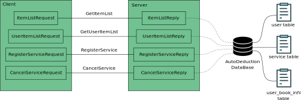

# C++ 设计题 -- 扣费管理设计文档

要求设计一个 **扣费服务管理** 的后台系统，具备  “查看扣费服务列表”、“开通扣费服务”、“关闭扣费服务” 的功能。

选择 GRPC 作为前后端通信的框架，采用 MySQl 存储数据。
软件实现的整体逻辑如下图所示：



客户端会向服务端发送四种请求：
- GetItemList：获取所有的扣费服务
- GetUserItemList：获取该用户订阅的扣非服务
- RegisterService：扣非服务订阅
- CancelService：扣费服务取消

由于采用 GRPC 框架，采用需要预先定义这四种服务的请求格式和应答格式，分别对应框图中 Client 和 Server 中的内容。

数据库中记录了
- 用户信息
- 扣费服务信息
- 用户订阅信息

在服务端对客户端服务的过程中，服务端会调用 MySQL 的语句，实现对数据库的增删改查。

## 通信接口定义

### 获取所有的扣费服务

#### 客户端
由于是获取所有的扣费服务，客户端的接口中无参数。

#### 服务端
服务端需要返回所有的扣费服务，因此，要以列表的形式返回扣费信息的 id 和名称，如下面的代码所示：
``` protobuf
message ItemListReply {
    repeated ServiceItem service_item = 1;
}

message ServiceItem {
    int32 id = 1;
    string name = 2;
}
```

### 获取用户订阅的扣费服务
#### 客户端
客户端需要发送用户的 id 给客户端。

``` protobuf
message UserItemListRequest {
    int32 uid = 1;
}
```
#### 服务端
与获取所有的扣费服务的服务端接口参数相同
``` protobuf
message UserItemListReply {
    repeated ServiceItem service_item = 1;
}
```

### 扣费服务订阅
#### 客户端
客户端的接口需要包括用户的 ID 和想要订阅的服务的 ID。

``` protobuf
message RegisterServiceRequest {
    int32 uid = 1;
    int32 service_id = 2;
}
```

#### 服务端
服务端需要返回状态，状态包括，无效的用户 ID，无效的服务 ID，用户已经注册过该项目，未知错误，订阅成功。

``` protobuf
message RegisterServiceRequest {
    int32 uid = 1;
    int32 service_id = 2;
}
```

### 扣费服务取消
#### 客户端
客户端的接口需要包括用户的 ID 和想要订阅的服务的 ID。

``` protobuf
message CancelServiceRequest {
    int32 uid = 1;
    int32 service_id = 2;
}
```

#### 服务端
服务端需要返回状态，状态包括，无效的用户 ID，无效的服务 ID，用户尚未注册该项目，未知错误，取消成功。

``` protobuf
message CancelServiceReply {
    enum State {
        UNKNOWN_FAIL = 0;
        SUCCESS = 1;
        NOT_REGISTER = 2;
        UID_FAIL = 3;
        SERVICE_ID_FAIL = 4;
    }
    State state = 1;
}
```
## 数据库表头

### 用户

用户表 user 包含用户 Id 和用户名两个字段

|用户 id|用户名|
|------|-----|
|1     | 张三 |
|...|...|

### 扣费服务

扣费服务表 service 包含服务 Id 和服务名两个字段

|扣非服务 id|扣非服务名|
|----------|------------|
|1         |膜拜单车自动扣费|
|...|...|

### 用户扣费服务信息
用户扣费服务信息 user_book_info 包含 Id，用户 Id，服务 Id 三个字段

|id|用户 id|服务id|
|--|------|------|
|1|1|1|
|...|...|...|
